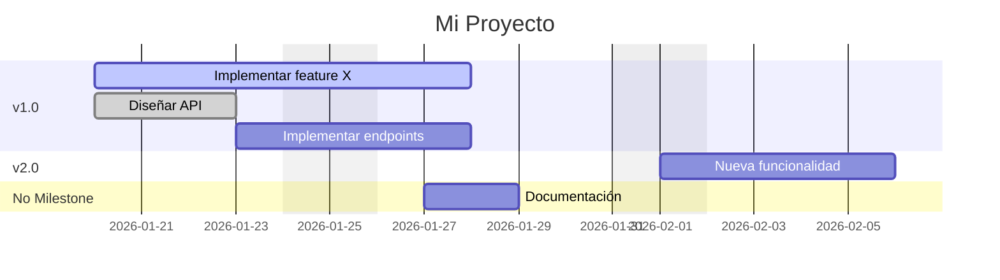

# GitHub Gaant

[](https://pypi.org/project/github-gaant/)

Gestiona tus issues de GitHub como tareas de un diagrama de Gantt. Sincroniza issues con un archivo YAML editable y genera visualizaciones Mermaid.

## Características

- **Pull**: Descarga issues de un GitHub Project V2 y genera automáticamente:
  - Archivo YAML editable
  - Archivo Excel editable
  - Diagrama Gantt en Mermaid
  - Archivos Markdown para contenido (`issues/*.md`)
- **Push**: Sube cambios locales a GitHub (desde YAML o Excel)
- **View**: Genera diagramas Mermaid Gantt para visualización
- **Formatos**: Soporta YAML (.yaml) y Excel (.xlsx) como archivo de trabajo
- **Sub-issues**: Soporte nativo para sub-issues de GitHub (jerarquía de tareas)
- **Progreso automático**: Calcula % de avance basado en sub-issues cerrados
- **Fechas desde Projects**: Lee/escribe campos de fecha personalizados del Project V2

## Arquitectura

```
┌─────────────────────┐     ┌──────────────────┐     ┌─────────────────┐
│   GitHub Project    │────▶│  gaant.yaml      │────▶│  Mermaid Gantt  │
│   (Issues + Dates)  │◀────│      OR          │     │  (visualización)│
│                     │     │  gaant.xlsx      │     │                 │
└─────────────────────┘     └──────────────────┘     └─────────────────┘
        │                           │
        │  GraphQL API              │  YAML/Excel Parser
        │  (Projects V2)            │
        │                           │
        │  REST API                 │
        │  (Issues CRUD)            │
        ▼                           ▼
┌─────────────────────────────────────────────────────────────────────────┐
│                           github-gaant CLI                              │
│  ┌─────────┐ ┌──────┐ ┌────────┐ ┌──────┐ ┌──────────┐ ┌──────────┐   │
│  │  init   │ │ pull │ │  push  │ │status│ │   view   │ │ validate │   │
│  └─────────┘ └──────┘ └────────┘ └──────┘ └──────────┘ └──────────┘   │
└─────────────────────────────────────────────────────────────────────────┘
```

## Instalación

### Opción 1: Desde PyPI (cuando esté publicado)

```bash
pip install github-gaant
```

### Opción 2: Desde GitHub

```bash
pip install git+https://github.com/lmatas/github-gaant.git
```

### Opción 3: Desarrollo local

```bash
git clone https://github.com/lmatas/github-gaant.git
cd github-gaant

# Crear entorno virtual
python3 -m venv .venv
source .venv/bin/activate  # macOS/Linux
# .venv\Scripts\activate   # Windows

# Instalar en modo editable
pip install -e .

# O con dependencias de desarrollo
pip install -e ".[dev]"
```

### Verificar instalación

```bash
gaant --help
```

## Configuración Inicial

### 1. Crear token de GitHub

Ve a **GitHub → Settings → Developer settings → Personal access tokens → Tokens (classic)**

Crea un token con los siguientes scopes:
- `repo` (acceso completo a repositorios)
- `project` (acceso a Projects V2)

### 2. Preparar GitHub Project

Tu GitHub Project V2 debe tener campos personalizados de tipo **Date**:
- **"Start date"** (o el nombre que prefieras)
- **"Target date"** (o el nombre que prefieras)

Para crear campos:
1. Abre tu Project en GitHub
2. Click en `+` para agregar campo
3. Selecciona "Date"
4. Nombra el campo (ej: "Start Date")

### 3. Inicializar configuración

```bash
gaant init --repo owner/repo --project 1
```

Opciones disponibles:
```bash
# Con YAML (default)
gaant init \
  --repo owner/repo \
  --project 1 \
  --start-field "Start Date" \
  --end-field "Due Date" \
  --output gaant.yaml

# Con Excel
gaant init \
  --repo owner/repo \
  --project 1 \
  --output gaant.xlsx
```

### 4. Agregar token

```bash
echo "GITHUB_TOKEN=ghp_tu_token_aqui" > .env
```

### 5. Verificar configuración

```bash
gaant validate
```

Salida esperada:
```
Checking configuration...
  ✓ Config loaded: owner/repo
Checking GitHub token...
  ✓ Token found
Testing GitHub connection...
  ✓ Project found: Mi Proyecto
  ✓ Start date field found: Start Date
  ✓ End date field found: Due Date

✓ Validation complete
```

## Comandos

### `gaant init`

Inicializa la configuración del proyecto.

```bash
gaant init --repo owner/repo --project 1
```

| Opción | Descripción | Default |
|--------|-------------|---------|
| `--repo`, `-r` | Repositorio (owner/repo) | *requerido* |
| `--project`, `-p` | Número del Project | *requerido* |
| `--start-field` | Nombre del campo de fecha inicio | "Start Date" |
| `--end-field` | Nombre del campo de fecha fin | "Due Date" |
| `--output`, `-o` | Archivo de salida | "gaant.yaml" |

---

### `gaant pull`

Descarga issues desde GitHub y guarda en múltiples formatos automáticamente.

```bash
gaant pull
```

| Opción | Descripción |
|--------|-------------|
| `--config`, `-c` | Ruta a config.yaml |
| `--output`, `-o` | Nombre base para archivos (override) |

**Archivos generados**: El comando `pull` sincroniza el estado completo:
- `gaant.yaml` - Estructura y metadatos (versión de control)
- `gaant.xlsx` - Interfaz de edición tipo hoja de cálculo
- `gaant_gantt.md` - Visualización rápida
- `issues/*.md` - Directorio con el cuerpo (descripción) de cada issue para edición cómoda

**Comportamiento**: Siempre sobrescribe los archivos locales (GitHub es fuente de verdad en pull).

---

### `gaant push`

Sube cambios locales a GitHub.

```bash
# Ver qué cambiaría (sin aplicar)
gaant push --dry-run

# Aplicar cambios desde YAML
gaant push --source gaant.yaml

# Aplicar cambios desde Excel
gaant push --source gaant.xlsx

# Aplicar cambios (usa archivo por defecto de config)
gaant push
```

| Opción | Descripción |
|--------|-------------|
| `--config`, `-c` | Ruta a config.yaml |
| `--source`, `-s` | Archivo fuente (.yaml o .xlsx) |
| `--dry-run`, `-n` | Solo mostrar cambios, sin aplicar |

| `--config`, `-c` | Ruta a config.yaml |
| `--source`, `-s` | Archivo fuente (.yaml o .xlsx) |
| `--dry-run`, `-n` | Solo mostrar cambios, sin aplicar |
| `--enforce-subissues` | Forzar creación de enlaces parent/child en GitHub |

**Operaciones soportadas**:
- Crear nuevos issues (cuando `issue: 0`)
- Actualizar título, labels, assignees
- Actualizar contenido (body) leyendo desde `issues/*.md`
- Actualizar fechas en campos del Project
- Agregar issues al Project automáticamente

---

### `gaant status`

Muestra diferencias entre archivo local y GitHub.

```bash
gaant status
```

Salida ejemplo:
```
┏━━━━━━━━━━━━┳━━━━━━━━━━┳━━━━━━━━━━━━━━━━━━━━━━━━━━━━━┓
┃ Type       ┃ Issue    ┃ Details                     ┃
┡━━━━━━━━━━━━╇━━━━━━━━━━╇━━━━━━━━━━━━━━━━━━━━━━━━━━━━━┩
│ NEW        │ Mi tarea │ new task to create          │
│ MODIFIED   │ #42      │ start_date: None → 2026-01-20│
└────────────┴──────────┴─────────────────────────────┘
```

---

### `gaant view`

Genera visualización del Gantt.

```bash
# Mermaid agrupado por milestone
gaant view --format mermaid

# Mermaid jerárquico por tareas padre
gaant view --format hierarchy

# Tabla markdown
gaant view --format table

# Guardar a archivo
gaant view --output gantt.md

# Incluir fines de semana
gaant view --weekends
```

| Opción | Descripción | Default |
|--------|-------------|---------|
| `--format`, `-f` | Formato: mermaid, hierarchy, table | mermaid |
| `--output`, `-o` | Guardar a archivo | stdout |
| `--no-weekends/--weekends` | Excluir/incluir fines de semana | excluir |

---

### `gaant validate`

Verifica configuración y conectividad.

```bash
gaant validate
```

Verifica:
- Archivo config.yaml existe y es válido
- Token GITHUB_TOKEN está configurado
- Conexión a GitHub funciona
- Project existe y es accesible
- Campos de fecha existen en el Project

## Formato del Archivo YAML

El archivo `gaant.yaml` tiene esta estructura:

```yaml
project:
  id: "PVT_kwDOABC123"           # ID GraphQL del Project
  number: 1                       # Número visible en URL
  title: "Mi Proyecto"
  url: "https://github.com/orgs/owner/projects/1"
  progress: 45                    # % calculado automáticamente

tasks:
  - issue: 42                     # Número del issue (0 = nuevo)
    title: "Implementar feature X"
    start: 2026-01-20             # Fecha inicio (YYYY-MM-DD)
    end: 2026-01-25               # Fecha fin
    assignees:                    # Lista de usuarios
      - usuario1
      - usuario2
    labels:                       # Etiquetas
      - feature
      - priority:high
    milestone: "v1.0"             # Milestone asociado
    progress: 50                  # % (auto-calculado de subtasks)
    subtasks:                     # Sub-issues anidados
      - issue: 43
        title: "Diseñar API"
        start: 2026-01-20
        end: 2026-01-22
        closed: true              # Issue cerrado
        progress: 100

  - issue: 0                      # issue: 0 = crear nuevo en push
    title: "Nueva tarea"
    start: 2026-02-01
    end: 2026-02-05
    assignees: ["usuario1"]
    labels: ["task"]
```

### Campos editables

| Campo | Descripción | Sincroniza con GitHub |
|-------|-------------|----------------------|
| `title` | Título del issue | ✅ Sí |
| `start` | Fecha inicio | ✅ Sí (campo Project) |
| `end` | Fecha fin | ✅ Sí (campo Project) |
| `assignees` | Usuarios asignados | ✅ Sí |
| `labels` | Etiquetas | ✅ Sí |
| `closed` | Marcar como cerrado | ✅ Sí |
| `subtasks` | Sub-issues | ✅ Sí (jerarquía nativa) |

### Campos de solo lectura

| Campo | Descripción |
|-------|-------------|
| `issue` | Número del issue (excepto 0 para nuevos) |
| `progress` | Calculado de subtasks cerrados |
| `milestone` | Solo lectura por ahora |

## Formato del Archivo Excel

Como alternativa al YAML, puedes usar Excel (`.xlsx`) para editar las tareas de forma más visual:

```bash
gaant init --repo owner/repo --project 1 --output gaant.xlsx
gaant pull
# Editar gaant.xlsx en Excel, Numbers o LibreOffice
gaant push
```

### Estructura del archivo Excel

El archivo tiene dos hojas:

**Hoja "Tasks"** - Contiene todas las tareas:

| Columna | Descripción | Editable |
|---------|-------------|----------|
| issue | Número del issue (0 = nuevo) | Solo para nuevos |
| title | Título de la tarea | ✅ Sí |
| start | Fecha inicio (YYYY-MM-DD) | ✅ Sí |
| end | Fecha fin (YYYY-MM-DD) | ✅ Sí |
| assignees | Usuarios separados por coma | ✅ Sí |
| labels | Etiquetas separadas por coma | ✅ Sí |
| milestone | Milestone asociado | ❌ No |
| closed | TRUE/FALSE | ✅ Sí |
| progress | % calculado automático | ❌ No |
| parent | Issue padre (para subtasks) | ⚠️ Ver nota |

> **Nota sobre `parent`**: La columna `parent` indica el número de issue padre. Las subtasks se reconstruyen automáticamente al cargar. No modificar manualmente a menos que quieras reorganizar la jerarquía.

**Hoja "Project Info"** - Metadatos del proyecto:

| Campo | Valor |
|-------|-------|
| id | ID GraphQL del Project |
| number | Número visible en URL |
| title | Nombre del proyecto |
| url | URL del proyecto |

### Ejemplo visual

```
┌────────┬─────────────────────┬────────────┬────────────┬───────────┬────────┐
│ issue  │ title               │ start      │ end        │ assignees │ parent │
├────────┼─────────────────────┼────────────┼────────────┼───────────┼────────┤
│ 42     │ Implementar feature │ 2026-01-20 │ 2026-01-25 │ user1     │        │
│ 43     │ Diseñar API         │ 2026-01-20 │ 2026-01-22 │ user2     │ 42     │
│ 0      │ Nueva tarea         │ 2026-02-01 │ 2026-02-05 │ user1     │        │
└────────┴─────────────────────┴────────────┴────────────┴───────────┴────────┘
```

### YAML vs Excel

| Característica | YAML | Excel |
|----------------|------|-------|
| Edición rápida de fechas | ⭐⭐ | ⭐⭐⭐ |
| Control de versiones (git) | ⭐⭐⭐ | ⭐ |
| Visualización tabular | ⭐ | ⭐⭐⭐ |
| Edición de jerarquías | ⭐⭐⭐ | ⭐⭐ |
| Filtros y ordenamiento | ❌ | ⭐⭐⭐ |
| Compartir con no-técnicos | ⭐ | ⭐⭐⭐ |

## Ejemplo de Salida Mermaid



### Estados de tareas en Mermaid

| Estado | Condición | Visualización |
|--------|-----------|---------------|
| `done` | Issue cerrado | Barra gris |
| `active` | Progreso > 0% | Barra resaltada |
| (normal) | Sin progreso | Barra estándar |
| `crit` | Crítico (futuro) | Barra roja |

## Archivos de Configuración

### config.yaml

```yaml
# Repositorio en formato owner/repo
repo: "owner/repo"

# Número del GitHub Project (visible en URL)
project_number: 1

# Mapeo de campos de fecha del Project
date_fields:
  start: "Start Date"    # Nombre exacto del campo en Project
  end: "Due Date"

# Archivo de salida para datos Gantt
output_file: "gaant.yaml"

# Opcional: filtrar por labels
# labels_filter: ["task", "feature"]

# Opcional: incluir issues cerrados en pull
include_closed: false
```

### .env

```bash
# Token de acceso personal de GitHub
# Scopes necesarios: repo, project
GITHUB_TOKEN=ghp_xxxxxxxxxxxxxxxxxxxx
```

## Flujo de Trabajo Típico

```bash
# 1. Setup inicial (una vez)
cd github-gaant
python3 -m venv .venv
source .venv/bin/activate
pip install -r requirements.txt
pip install -e .

# 2. Configurar proyecto
gaant init --repo miorg/miproyecto --project 1
echo "GITHUB_TOKEN=ghp_xxx" > .env
gaant validate

# 3. Descargar estado actual (genera .yaml, .xlsx y _gantt.md)
gaant pull

# 4. Editar gaant.yaml o gaant.xlsx
#    - Ajustar fechas
#    - Agregar nuevas tareas (issue: 0)
#    - Cambiar asignaciones

# 5. Ver cambios pendientes
gaant status

# 6. Subir a GitHub
gaant push --source gaant.yaml --dry-run   # revisar primero
gaant push --source gaant.yaml             # aplicar desde YAML
# o
gaant push --source gaant.xlsx             # aplicar desde Excel

# 7. Regenerar visualización después de cambios
gaant pull

# 8. Ver diagrama Gantt
# Abrir gaant_gantt.md en VS Code con preview (Cmd+Shift+V)
```

## Estructura del Proyecto

```
github-gaant/
├── github_gaant/           # Paquete principal
│   ├── __init__.py
│   ├── cli.py              # Comandos CLI (typer)
│   ├── config.py           # Carga config.yaml + .env
│   ├── models.py           # Modelos Pydantic (Task, Project)
│   ├── github_graphql.py   # Cliente GraphQL (Projects V2)
│   ├── github_rest.py      # Cliente REST (Issues CRUD)
│   ├── sync.py             # Lógica de sincronización
│   └── parsers/
│       ├── __init__.py
│       ├── yaml_parser.py  # Parser YAML bidireccional
│       ├── excel_parser.py # Parser Excel bidireccional
│       └── mermaid_gen.py  # Generador de diagramas
├── tests/
│   ├── __init__.py
│   ├── test_models.py
│   ├── test_parsers.py
│   └── test_excel_parser.py
├── pyproject.toml          # Configuración del paquete pip
├── LICENSE                 # Licencia MIT
└── README.md
```

## Archivos Generados por Pull

| Archivo | Descripción | Uso recomendado |
|---------|-------------|-----------------|
| `gaant.yaml` | Datos en formato YAML | Control de versiones, edición técnica |
| `gaant.xlsx` | Datos en formato Excel | Edición visual, compartir con equipo |
| `gaant_gantt.md` | Diagrama Mermaid Gantt | Visualización, documentación |

## Dependencias

| Paquete | Uso |
|---------|-----|
| PyGithub | REST API para Issues |
| gql | GraphQL API para Projects V2 |
| pyyaml | Parser YAML |
| openpyxl | Parser Excel (.xlsx) |
| typer | CLI framework |
| rich | Output formateado en terminal |
| pydantic | Validación de datos |
| python-dotenv | Variables de entorno |

## Limitaciones Conocidas

1. **Milestones**: Solo lectura, no se pueden crear/modificar via push
2. **Sub-issues de sub-issues**: Soportado hasta 8 niveles (límite de GitHub)
3. **Campos custom**: Solo soporta campos DATE del Project, no otros tipos
4. **Rate limits**: GitHub limita a 5000 requests/hora (GraphQL tiene costo variable)

## Desarrollo

```bash
# Instalar con deps de desarrollo
pip install -e ".[dev]"

# Ejecutar tests
pytest tests/ -v

# Formatear código
black github_gaant/
ruff check github_gaant/
```

## Publicar en PyPI

```bash
# Instalar herramientas de build
pip install build twine

# Construir el paquete
python -m build

# Subir a TestPyPI (prueba)
twine upload --repository testpypi dist/*

# Subir a PyPI (producción)
twine upload dist/*
```

## Autor

**Lautaro Matas**  
📧 lmatas@gmail.com  
🔗 [GitHub](https://github.com/lmatas)

## Licencia

MIT
